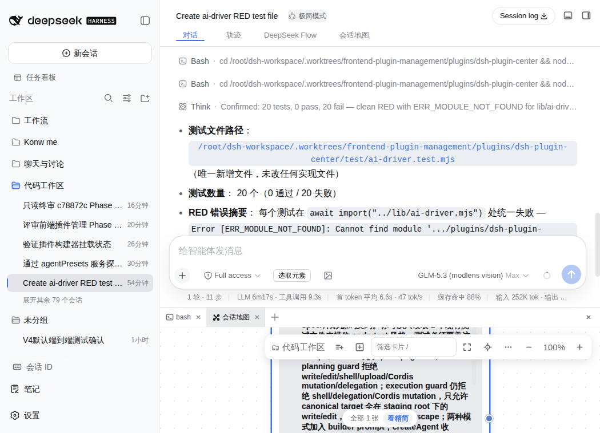

# dsh-session-atlas · 会话地图

**把对话从瀑布变成地图。**

DeepSeek Harness（DSH）的非线性对话地图：会话不再是聊不完的滚动瀑布，而是一张可以缩放、拖拽、导航的 DAG 卡片图——每个回合是一张完整卡片，分支清晰可见，AI 的回答在卡片上实时生长。

从 [dsh-synapse](../dsh-synapse) 血统抽取（v0.2.0 起：纯地图，Context Graph 引擎已独立为 [dsh-context-graph](../dsh-context-graph)）。



## 功能

- **回合卡片 DAG**：`Turn N-M` 编号、贝塞尔血缘连线、祖先高亮、折叠芯片
- **画布交互**：相机惯性平移/缩放、卡片拖拽与自适应尺寸、快捷键、视图适配（tidy/focus）
- **分支工作流**：从任意回合开分支、草稿卡、乐观更新、归档——探索式思考不丢线索
- **实时生长**：流式文本平滑呈现（FPS 守卫）、跨会话 watchLive 观看
- **检视三件**：停靠式回合检查器（TurnInspector）、详情视图、compare 双栏对比
- **移动端**：手机触控/抽屉手势优先适配
- **双通道挂载**：官方 `conversation.view` 插槽 + [dsh-better-sidebar](https://github.com/omdsh-dev/DSH-better-sidebar) 标签页（未装 better-sidebar 时走官方插槽，不阻塞启动）

## 安装

```bash
dsh plugin --profile web add github:martinkot9336299-cell/dsh-session-atlas
```

（或本地路径 `dsh plugin --profile web add /path/to/dsh-session-atlas`）

## 说明

- 内部 CSS 类前缀 `.syn-` 与 localStorage 键 `syn-*` 继承自 synapse 血统，未做改名——如果你的机器上同时装过 dsh-synapse，请先卸载它再装本插件（两者共用画布状态键会互相干扰）。
- 数据文件默认 `~/.dsh/session-atlas/workspaces.json`，可在 profile 的 cordis.patch.yml 里用 `dataFile` 覆盖。旧图事件文件（graph-events.jsonl）会被忽略，可手动删除。
- 运行时仅依赖 DSH 宿主提供的服务；Node ≥ 22.19。

## License

MIT
